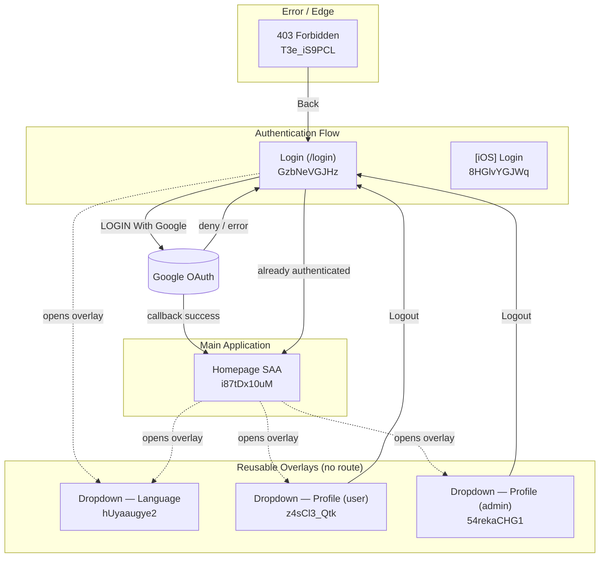

# Screen Flow Overview

## Project Info
- **Project Name**: SAA 2025 (Sun Annual Awards 2025)
- **Figma File Key**: 9ypp4enmFmdK3YAFJLIu6C
- **Figma URL**: https://www.figma.com/design/9ypp4enmFmdK3YAFJLIu6C
- **Created**: 2026-05-07
- **Last Updated**: 2026-05-07 (drift sync — locale endpoint + component filename aligned with shipped code)

> Companion file: `.momorph/contexts/SCREENFLOW.md` — keeps the in-depth navigation
> graph + edge-confidence audit (per Constitution Principle III). This document is
> the high-level discovery / index view.

---

## Discovery Progress

| Metric | Count |
|--------|-------|
| Total Screens (known) | 7 |
| Reusable Components (overlays) | 3 |
| Surveyed in depth | 2 (Login, Dropdown — Language) |
| Remaining | 5 |
| Completion | ~29% |

---

## Screens

| # | Screen Name | Frame ID | Figma Link | Status | Detail File | Predicted APIs | Navigations To |
|---|-------------|----------|------------|--------|-------------|----------------|----------------|
| 1 | Login | `GzbNeVGJHz` | https://www.figma.com/design/9ypp4enmFmdK3YAFJLIu6C?node-id=GzbNeVGJHz | surveyed | `specs/GzbNeVGJHz-login/spec.md` | `POST /api/auth/signin/google`, `GET /api/auth/callback/google`, `POST /api/auth/signout`, `POST /api/i18n/locale` | Homepage SAA, Dropdown — Language |
| 2 | Homepage SAA | `i87tDx10uM` | https://www.figma.com/design/9ypp4enmFmdK3YAFJLIu6C?node-id=i87tDx10uM | pending | — | `GET /users/me` (predicted) | TBD |
| 3 | Error page — 403 | `T3e_iS9PCL` | https://www.figma.com/design/9ypp4enmFmdK3YAFJLIu6C?node-id=T3e_iS9PCL | pending | — | — | Login (inferred) |
| 4 | [iOS] Login | `8HGlvYGJWq` | https://www.figma.com/design/9ypp4enmFmdK3YAFJLIu6C?node-id=8HGlvYGJWq | pending | — | (same as Login) | (same as Login) |

### Reusable Components (Overlays — not routes)

| # | Component Name | Frame ID | Figma Link | Status | Used By | Navigations To |
|---|----------------|----------|------------|--------|---------|----------------|
| C1 | Dropdown — Language | `hUyaaugye2` | https://www.figma.com/design/9ypp4enmFmdK3YAFJLIu6C?node-id=hUyaaugye2 | surveyed (2026-05-07) | Login (`GzbNeVGJHz`), Homepage SAA (inferred), other authenticated screens with the header | none — selection updates locale in place |
| C2 | Dropdown — Profile (user) | `z4sCl3_Qtk` | https://www.figma.com/design/9ypp4enmFmdK3YAFJLIu6C?node-id=z4sCl3_Qtk | pending | authenticated user routes | Login (Logout — inferred) |
| C3 | Dropdown — Profile (admin) | `54rekaCHG1` | https://www.figma.com/design/9ypp4enmFmdK3YAFJLIu6C?node-id=54rekaCHG1 | pending | admin routes | Login (Logout — inferred) |

---

## Component Details — `C1` Dropdown — Language (`hUyaaugye2`)

**Type**: Reusable overlay component (NOT a standalone screen — no URL of its own).

**Anchor**: Header language chip on every screen that exposes locale switching. Confirmed
on Login (`A.2 / I662:14391;186:1601`); inferred on Homepage SAA and any other route that
renders the same header.

**Structure** (from Figma):
- `Dropdown-List` (`525:11713`) — main container.
  - Selected display row: chip "VN" with Vietnam flag, dark grey background.
  - Item `tiếng Việt` (`I525:11713;362:6085`) — selects `vi-VN` (chip `VN`).
  - Item `tiếng Anh` (`I525:11713;362:6128`, 110×56, dark background) — selects `en-US` (chip `US`).

**Behavior**:
- Click on header chip → opens this overlay.
- Click on a language item → updates the active locale in place; does NOT navigate.
- Click outside / `Esc` → closes the overlay.
- Persistence: `saa_locale` cookie for everyone; for authenticated users the choice is
  also mirrored to `User.locale` via `POST /api/i18n/locale` (optimistic, reverted on
  failure). See Login spec FR-007 / FR-008.

**Edges**: none outgoing. Incoming = "open" trigger from each host screen's header.

**Implementation status**: **Already shipped** with the Login feature (commit `8c0022f`).
The shared React component is [src/components/header/LanguageSelector.tsx](src/components/header/LanguageSelector.tsx)
(file is named `LanguageSelector`, not `LanguageDropdown`); it is mounted via
[src/components/header/Header.tsx](src/components/header/Header.tsx). Locale types and
display map live at [src/lib/i18n/types.ts](src/lib/i18n/types.ts); cookie helpers at
[src/lib/cookies/saa-locale.ts](src/lib/cookies/saa-locale.ts); API at
[app/api/i18n/locale/route.ts](app/api/i18n/locale/route.ts). Frame `hUyaaugye2` is a
visual refresh of this component, not a fresh build target.

---

## Navigation Graph

> Dotted edges = overlay open/close (no navigation).
> Solid edges between routes = real navigation.

---

## Screen Groups

### Group: Authentication
| Screen | Purpose | Entry Points |
|--------|---------|--------------|
| Login (`GzbNeVGJHz`) | Google-OAuth-only sign-in | App entry, Logout from any auth page, 403 → Back |
| [iOS] Login (`8HGlvYGJWq`) | Mobile variant of Login | Same as Login (likely a responsive single route) |

### Group: Main Application
| Screen | Purpose | Entry Points |
|--------|---------|--------------|
| Homepage SAA (`i87tDx10uM`) | Post-auth landing | Login success, direct visit while authenticated |

### Group: Errors
| Screen | Purpose | Entry Points |
|--------|---------|--------------|
| 403 (`T3e_iS9PCL`) | Access denied | Authorization failures |

### Group: Reusable Overlays (no route)
| Component | Purpose | Hosted by |
|-----------|---------|-----------|
| Dropdown — Language (`hUyaaugye2`) | Switch UI locale (VN ↔ EN) | Login, Homepage SAA, any header-bearing screen |
| Dropdown — Profile user (`z4sCl3_Qtk`) | User account actions, Logout | Authenticated user routes |
| Dropdown — Profile admin (`54rekaCHG1`) | Admin account actions, Logout | Admin routes |

---

## API Endpoints Summary

| Endpoint | Method | Screens Using | Purpose |
|----------|--------|---------------|---------|
| `/api/auth/signin/google` | POST | Login | Initiate Google OAuth |
| `/api/auth/callback/google` | GET | Login (callback) | OAuth callback |
| `/api/auth/signout` | POST | Profile dropdowns | Sign out, clear session |
| `/api/i18n/locale` | POST | Dropdown — Language (host: any auth screen) | Persist locale for authenticated user (writes `User.locale` + mirrors `saa_locale` cookie). Returns 401 unauthenticated, 400 on invalid body, 204 on success. |
| `/api/users/me` | GET | Homepage SAA (predicted) | Load profile after login |

---

## Technical Notes

### Authentication Flow
- Auth.js (NextAuth) — Google provider only.
- Session check via `auth()` helper in Server Components / middleware; authenticated visitors
  to `/login` are redirected before any markup is sent.

### Locale Handling (Dropdown — Language)
- Default locale: `vi-VN` (chip `VN`); alternative `en-US` (chip `US`).
- Allowlisted locales: `vi-VN`, `en-US`. Single source of truth for the allowlist + chip + flag map: [src/lib/i18n/types.ts](src/lib/i18n/types.ts) (`SUPPORTED_LOCALES`, `LOCALE_DISPLAY`). Server-side enforcement per Login spec TR-006 lives in [src/lib/cookies/saa-locale.ts](src/lib/cookies/saa-locale.ts) (`getSaaLocale` clears tampered values).
- Unauthenticated users: `saa_locale` cookie only (1y, `SameSite=Lax`, `Path=/`, `HttpOnly=false`).
- Authenticated users: cookie + `User.locale` row, updated via `POST /api/i18n/locale` (optimistic UI, reverted in `LanguageSelector.tsx` if the call fails).
- Translation helper: custom `t(key, locale)` at [src/lib/i18n/index.ts](src/lib/i18n/index.ts) over per-locale JSON catalogs (`src/lib/i18n/catalogs/{vi-VN,en-US}.json`). The project deliberately did NOT adopt `next-intl` — do not reintroduce it without an explicit cross-cutting decision.

### Routing
- Next.js App Router. Protected routes require an authenticated session.

---

## Discovery Log

| Date | Action | Screens / Components | Notes |
|------|--------|----------------------|-------|
| 2026-05-06 | Initial survey | Login (`GzbNeVGJHz`) | Spec + plan + tasks completed; outgoing edges to Homepage and Dropdown — Language confirmed. |
| 2026-05-07 | Component survey | Dropdown — Language (`hUyaaugye2`) | Reusable overlay; VN + EN items mapped; no navigation edges. |
| 2026-05-07 | Drift sync | Dropdown — Language (`hUyaaugye2`) | Aligned doc with shipped code: API path `POST /api/i18n/locale` (was `PATCH /api/users/me/locale`); component file `LanguageSelector.tsx` (was `LanguageDropdown.tsx`); expanded Locale Handling section with concrete file paths; noted that frame `hUyaaugye2` is a visual refresh, not a new build. |

---

## Next Steps

- [ ] Survey Homepage SAA (`i87tDx10uM`) — confirm header (which mounts Dropdown — Language) and outgoing edges to Profile dropdowns.
- [ ] Survey Profile dropdowns (`z4sCl3_Qtk`, `54rekaCHG1`) — confirm Logout → Login edge and other actions.
- [ ] Survey 403 page (`T3e_iS9PCL`) — confirm "Back" target.
- [ ] Decide responsive vs. separate route for `[iOS] Login` (`8HGlvYGJWq`).
- [ ] Reconcile this overview with `.momorph/contexts/SCREENFLOW.md` after each new screen survey.
